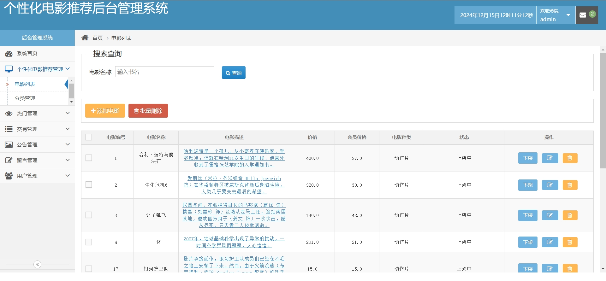

# 个性化电影推荐系统(数据库加VX获取☟)
> VX：13033494971
#### 介绍
个性化电影推荐系统
有BUG可留言加微

#### 软件架构
Java + SpringBoot + Mybatis + Mysql

#### 项目功能说明

1.  管理员功能
> + 电影管理：电影列表、分类管理
> + 热门电影管理
> + 交易管理：订单管理、交易统计
> + 公告管理
> + 留言管理
> + 用户管理：用户列表、个人信息
2.  用户功能
> + 登录注册
> + 首页：轮播图、公告栏、电影推荐（协同过滤算法）
> + 电影：电影分类查询、电影详情
> + 收藏列表、结算页面
> + 用户评价
> + 个人中心：我的电影票详情、账户管理

### 部分功能演示

### 环境需求(可免费提供)
- idea/eclipse、jdk-1.8、maven-3.8.6、mysql、nodejs等

## 有项目修改、安装调试需求 请联系微信

## 其他项目定制加微☝☝☝
